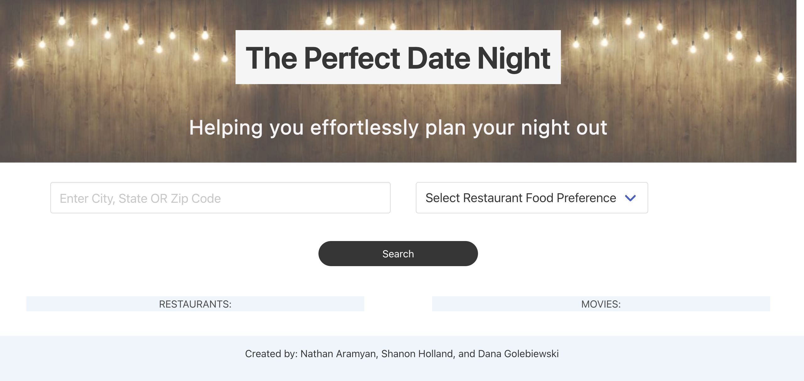

# group-project
By Nathan Aramyan, Shanon Holland, and Dana Golebiewski

## User Story 

AS A person looking to set up a date,
I WANT to be able to quickly search for a restaurant and find movie theaters that are nearby with movies and times available 
SO I can easily create a date night without stress 

## Description 

This app was created to help people easily find a restaurant to eat at, and a nearby movie theater with movies and times available. You are able to search by city or zip code and see available restaurants. Once you choose a restaurant, nearby movie theaters will show up with movies that are available.

## Built With 

HTML, CSS, Bulma, JavaScript and JQuery 

## Link to final version 

[Site Link]/(https://danagolebiewski.github.io/the-perfect-date/)

## Website Preview 

